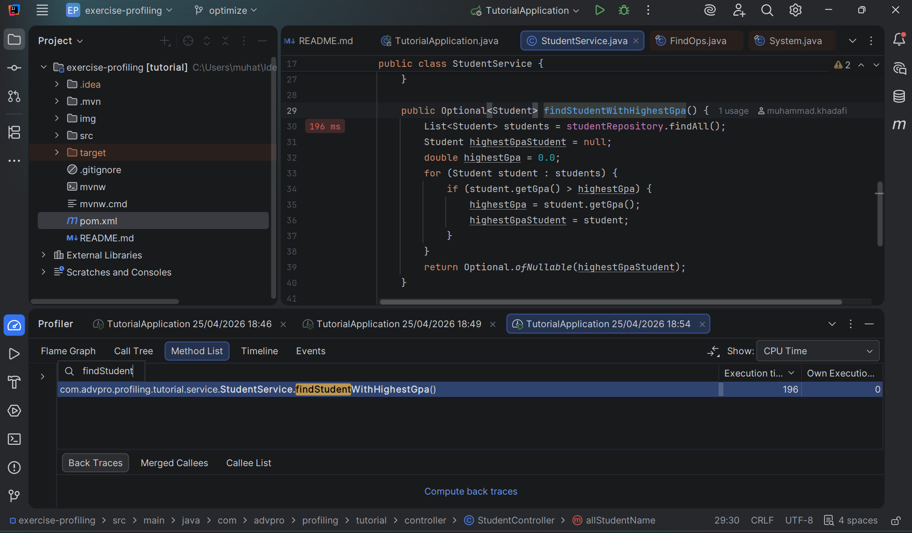
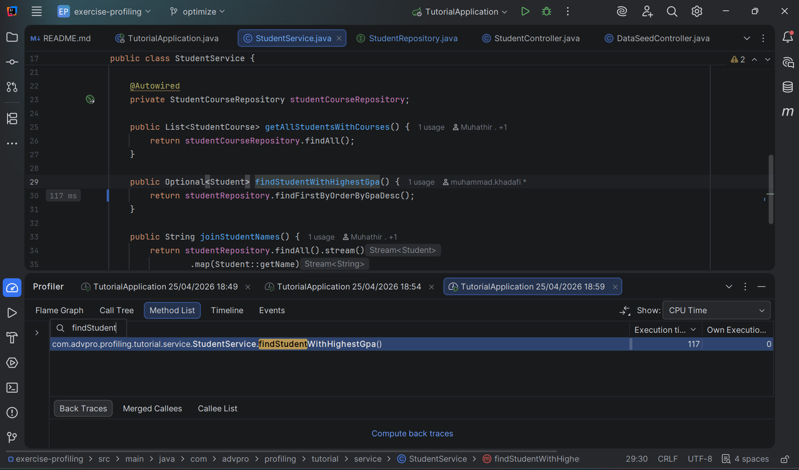
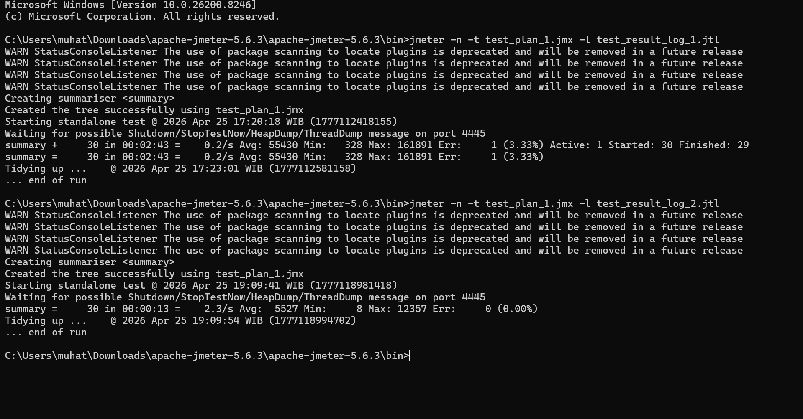

### Lampiran Screenshot Performance Tesing (JMeter)

Gambar 1: Penggunaan JMeter-GUI untuk Test Creation  

Gambar 2: Penggunaan JMeter-CLI untuk Load Testing  

Gambar 3: Hasil Load Testing 

### Lampiran Screenshot Optimizing (Profiling Intellij)

Gambar 4 & 5: Perbandingan pre-post refactor method GetAllStudentWithCourse   

Gambar 6 & 7: Perbandingan pre-post refactor method joinStudentNames  

Gambar 8 & 9: Perbandingan pre-post refactor method joinStudentNames
  Jika diperhatikan sekilas, performa post-optimize sudah lebih cepat sebanyak lebih dari 20% (CPU Time).
 
### Perbandingan Hasil Optimizing di JMeter

 Gambar 10: Perbandingan load test di CLI JMeter  
Setelah melakukan *profiling* dan optimasi kode (refactoring), pengujian performa ulang dilakukan menggunakan JMeter dengan konfigurasi *load testing* yang sama persis. Hasilnya menunjukkan peningkatan performa yang sangat signifikan:

* **Total Waktu Eksekusi:** Turun drastis dari **2 menit 43 detik** menjadi hanya **13 detik**.
* **Throughput:** Meningkat tajam dari **0.2 requests/second** menjadi **2.3 requests/second**, menandakan kapasitas server melayani *user* naik lebih dari 10 kali lipat.
* **Average Response Time:** Waktu tunggu rata-rata membaik secara masif dari **~55,4 detik** menjadi hanya **~5,5 detik** per request.
* **Error Rate:** Turun dari **3.33%** (kemungkinan akibat *timeout* antrean query) menjadi **0.00%** (stabil).

### Refleksi Akhir Dokumen
**1. What is the difference between the approach of performance testing with JMeter and profiling with IntelliJ Profiler in the context of optimizing application performance?**

JMeter melakukan pengujian dari "luar" (mengukur performa keseluruhan seperti *throughput* dan waktu respons), sedangkan IntelliJ Profiler menguji dari "dalam" (membedah detail eksekusi kode, penggunaan CPU, dan memori baris per baris).

---

**2. How does the profiling process help you in identifying and understanding the weak points in your application?**

Proses ini memvisualisasikan eksekusi kode (misalnya dengan *Flame Graph*), sehingga sangat mudah untuk melihat *method* atau *query* database mana yang paling banyak memakan waktu atau memori.

---

**3. Do you think IntelliJ Profiler is effective in assisting you to analyze and identify bottlenecks in your application code?**

Ya, sangat efektif. Jika JMeter hanya memberi tahu *bahwa* aplikasi lambat, Profiler bisa langsung menunjuk ke *baris kode spesifik* yang menjadi biang kerok (*bottleneck*).

---

**4. What are the main challenges you face when conducting performance testing and profiling, and how do you overcome these challenges?**

Tantangan utamanya adalah banyaknya data proses *background* bawaan framework yang ikut terekam. Saya mengatasinya dengan memfilter hasil *profiler* agar hanya fokus pada *package* aplikasi saya (misal: `com.advpro...`) dan mencari durasi eksekusi yang paling panjang.

---

**5. What are the main benefits you gain from using IntelliJ Profiler for profiling your application code?**

Keuntungan terbesarnya adalah integrasi langsung dengan IDE. Saat menemukan *method* yang lambat di laporan *profiling*, saya bisa langsung mengkliknya dan seketika diarahkan ke *source code* untuk diperbaiki.

---

**6. How do you handle situations where the results from profiling with IntelliJ Profiler are not entirely consistent with findings from performance testing using JMeter?**

Jika Profiler menunjukkan kode berjalan cepat tapi JMeter mencatat waktu respons yang lambat, berarti masalahnya ada di luar kode aplikasi. Saya akan mengecek faktor eksternal seperti latensi jaringan, batas koneksi *database* (misal: antrean HikariCP), atau spesifikasi *hardware* server.

---

**7. What strategies do you implement in optimizing application code after analyzing results from performance testing and profiling? How do you ensure the changes you make do not affect the application's functionality?**

Strategi utama saya adalah memindahkan beban proses yang berat ke tempat yang tepat, contohnya meminta *database* melakukan *sorting* (pakai JPA *Derived Queries*) dan menghemat memori Java (pakai *Stream API* dibanding *looping* biasa). Untuk memastikan aplikasi tidak rusak, saya selalu mengecek ulang hasil respons *endpoint* secara manual.