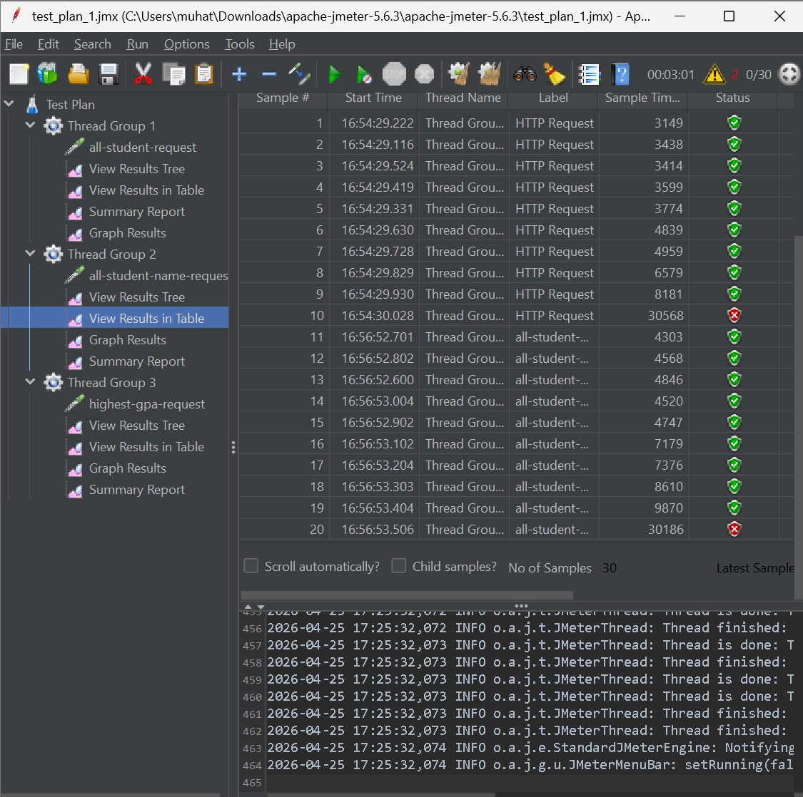
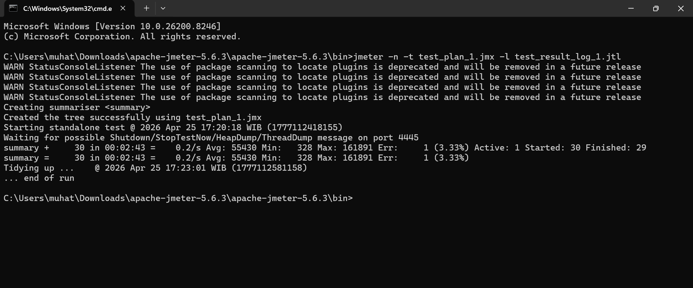
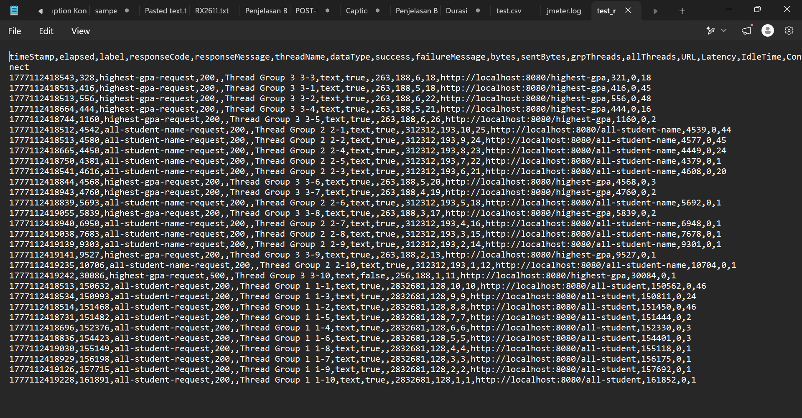
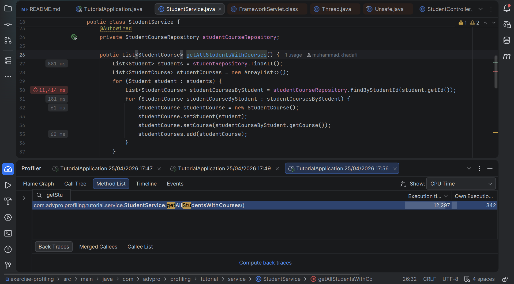
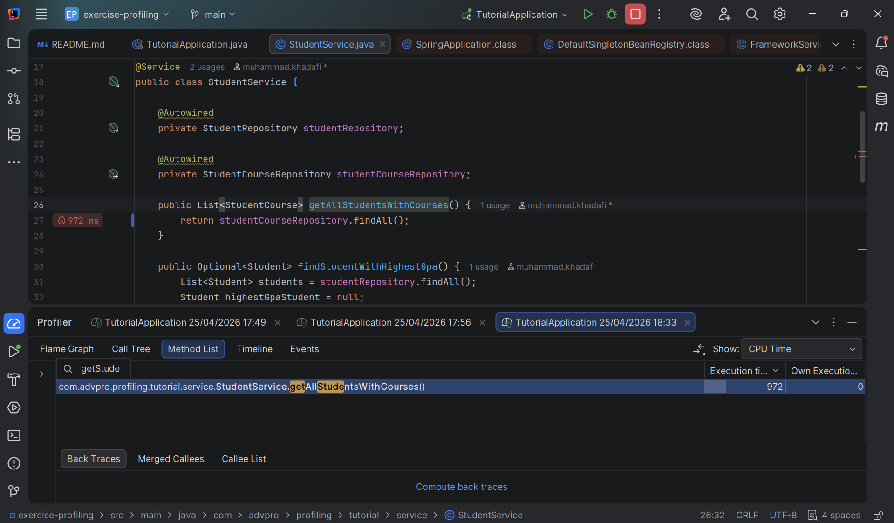
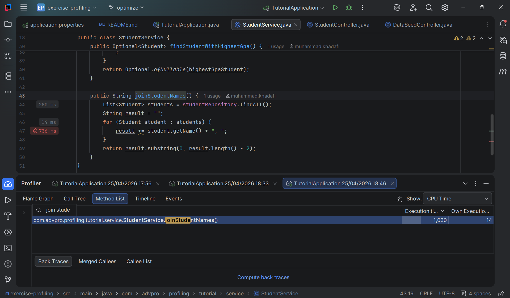
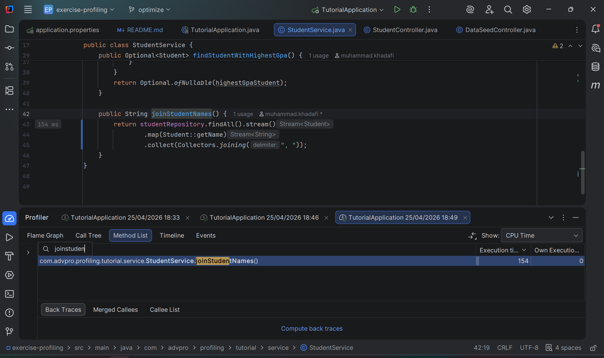

### Lampiran Screenshot Performance Tesing (JMeter)

Gambar 1: Penggunaan JMeter-GUI untuk Test Creation

Gambar 2: Penggunaan JMeter-CLI untuk Load Testing

Gambar 3: Hasil Load Testing

### Lampiran Screenshot Performance Tesing (JMeter)

Gambar 4 & 5: Perbandingan pre-post refactor method GetAllStudentWithCourse 

Gambar 6 & 7: Perbandingan pre-post refactor method joinStudentNames

